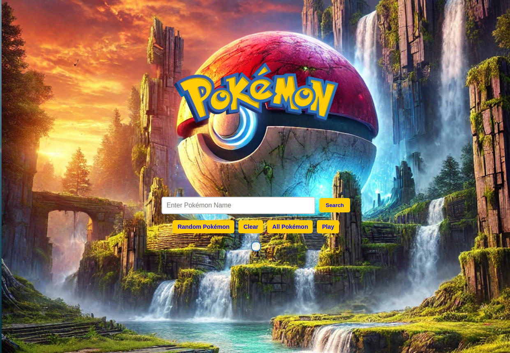
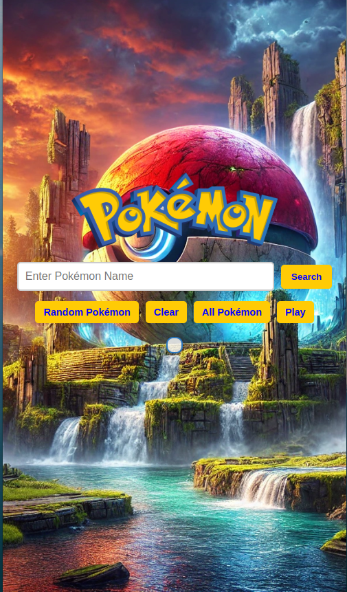
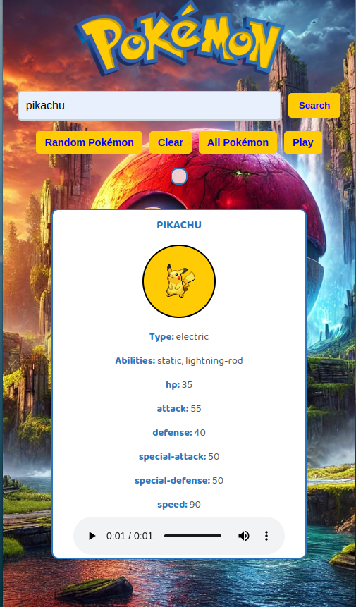
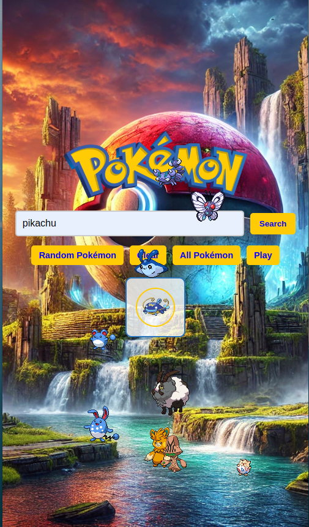

# Pokémon Arama ve Yakalama Oyunu (Türkçe 🇹🇷)

[PokéAPI](https://pokeapi.co/) kullanarak Pokémon arayabileceğiniz, görüntüleyebileceğiniz ve yakalayabileceğiniz eğlenceli bir Pokémon web uygulaması. Animasyonlar, Pokémon detayları (yetenekler, istatistikler, türler) ve yakalandığında çıkan ses efektlerini içerir. Tüm Pokémon'ları yakaladığınızda konfeti efektiyle kutlama yaparak keyifli bir deneyim sunar.

---

## **Demo**
Canlı demoyu buradan deneyebilirsiniz:

[Canlı Demo](https://orhanguezel.github.io/Pokemon/)

---

## **Özellikler**

- **Pokémon Ara**: Pokémon ismi girerek detaylarını görüntüleyin (istatistikler, yetenekler ve tür).  
- **Rastgele Pokémon**: Rastgele bir Pokémon görüntüleyin ve detaylarını inceleyin.  
- **Tüm Pokémon**: Rastgele 10 Pokémon'u görüntüleyin.  
- **Pokémon Yakalama**: Pokémon resimlerine tıklayarak onları yakalayın.  
- **Animasyonlar**: Pokémon'lar "Oyun Modu"nda ekranda rastgele hareket eder.  
- **Ses Efektleri**: Yakalanan Pokémon'un sesi otomatik olarak çalar.  
- **Konfeti Kutlaması**: Tüm Pokémon'ları yakaladığınızda konfeti efektiyle kutlama yapılır.

---

## **Önizleme**

### 🎮 Oyun Arayüzü

  
  
  


---

## **Yerel Olarak Çalıştırma**

1. **Repository'yi klonlayın**:
   ```bash
   git clone https://github.com/Orhanguezel/Pokemon.git
   cd pokemon-catch-game
   ```

2. **Tarayıcıda açın**:
   - `index.html` dosyasını tercih ettiğiniz tarayıcıda açın.

---

## **Bağımlılıklar**

- **HTML, CSS, JavaScript**  
- **[PokeAPI](https://pokeapi.co/)** - Pokémon verilerini getirmek için kullanılır.  
- **Konfeti Kütüphanesi**: [Canvas-Confetti](https://cdn.jsdelivr.net/npm/canvas-confetti).

---

## **Proje Yapısı**

```
pokemon-catch-game/
│
├── index.html           # Ana HTML dosyası
├── style.css            # Tasarım için CSS dosyası
├── app.js               # Ana JavaScript dosyası
├── assets/
│   ├── logo.png         # Pokémon logosu
│   ├── background-1.png # Arka plan görseli
│   └── demo.png         # Demo ekran görüntüsü
└── README.md            # Proje açıklaması
```

---

## **Nasıl Oynanır**

1. **Pokémon Ara**:
   - Arama kutusuna bir Pokémon ismi girin ve "Search" butonuna tıklayın.
   - Pokémon'un detayları, resmi ve sesi ekranda görüntülenir.

2. **Rastgele Pokémon**:
   - "Random Pokémon" butonuna tıklayarak rastgele bir Pokémon görüntüleyin.

3. **Pokémon Yakalama**:
   - "Play" veya "All Pokémon" modunda Pokémon resimlerine tıklayarak onları yakalayın.  
   - Yakalanan Pokémon'lar üst kutuya eklenir ve sesi otomatik olarak çalar.

4. **Kutlama**:
   - "Play" veya "All Pokémon" modunda tüm Pokémon'ları yakalayın.  
   - Konfeti efekti ve kutlama mesajı gösterilir.

---

## **Katkı Sağlayanlar**

- Pokémon verileri ve görselleri [PokeAPI](https://pokeapi.co/) tarafından sağlanmaktadır.  
- Konfeti efekti [Canvas-Confetti](https://www.kirilv.com/canvas-confetti/) kullanılarak oluşturulmuştur.

---

## **Lisans**

Bu proje açık kaynaklıdır ve MIT Lisansı altında sunulmaktadır.

```

---

## **Açıklama**

1. **Demo Linki**: **`https://orhanguezel.github.io/Pokemon/`** doğru demo bağlantısı olarak kullanılmıştır.  
2. **Görseller**: **`./demo.png`, `./demo2.png`, `./demo3.png`, `./demo4.png`** yerel görseller olarak gösterilmiştir.